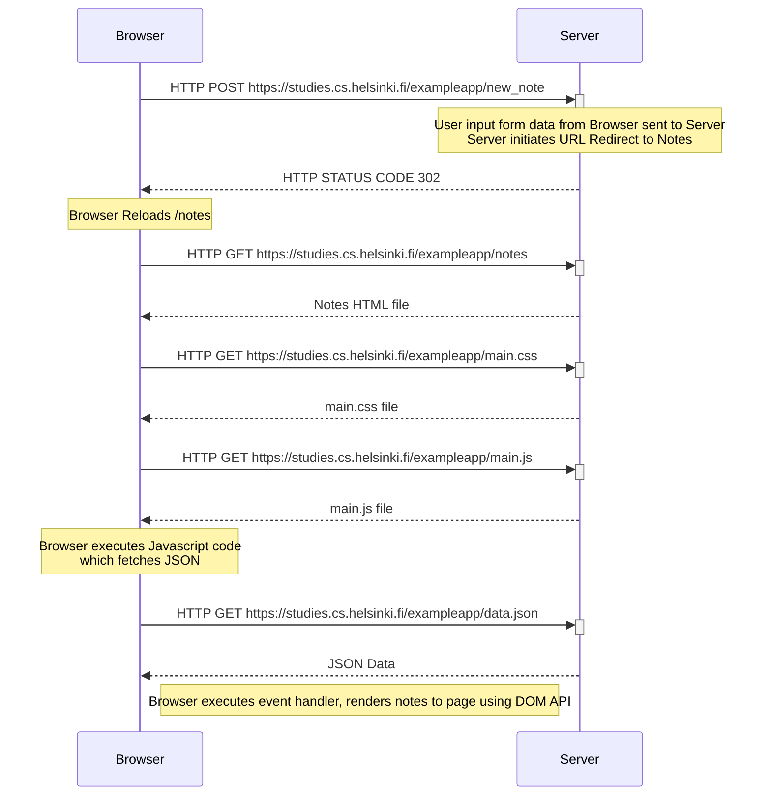

```mermaid
sequenceDiagram
    Participant A as Browser
    Participant B as Server
    A->>+B: HTTP POST https://studies.cs.helsinki.fi/exampleapp/new_note
    Deactivate B
        Note over B: User input form data from Browser sent to Server<br>Server initiates URL Redirect to Notes
    B-->>A: HTTP STATUS CODE 302 
    Note over A: Browser Reloads /notes
    A->>+B: HTTP GET https://studies.cs.helsinki.fi/exampleapp/notes
    Deactivate B
    B-->>A: <br>Notes HTML file
    A->>+B: <br>HTTP GET https://studies.cs.helsinki.fi/exampleapp/main.css
    Deactivate B
    B-->>A: <br>main.css file
    A->>+B: <br>HTTP GET https://studies.cs.helsinki.fi/exampleapp/main.js
    Deactivate B
    B-->>A: <br>main.js file
    Note over A: Browser executes Javascript code<br>which fetches JSON
    A->>+B: <br>HTTP GET https://studies.cs.helsinki.fi/exampleapp/data.json
    Deactivate B
    B-->>A: <br>JSON Data
    Note right of A: Browser executes event handler, renders notes to page using DOM API
```