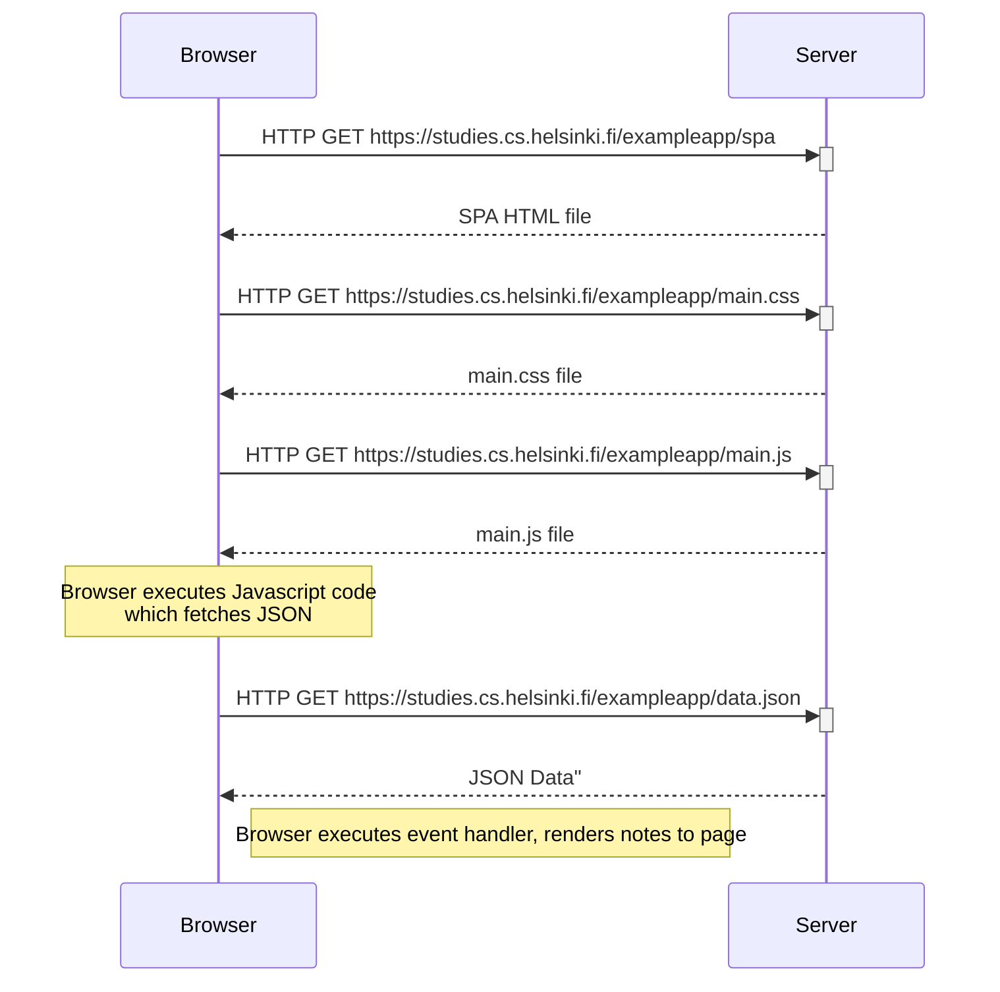

```mermaid
sequenceDiagram
    Participant A as Browser
    Participant B as Server
    A->>+B: HTTP GET https://studies.cs.helsinki.fi/exampleapp/spa
    Deactivate B
    B-->>A: <br>SPA HTML file
    A->>+B: <br>HTTP GET https://studies.cs.helsinki.fi/exampleapp/main.css
    Deactivate B
    B-->>A: <br>main.css file
    A->>+B: <br>HTTP GET https://studies.cs.helsinki.fi/exampleapp/main.js
    Deactivate B
    B-->>A: <br>main.js file
    Note over A: Browser executes Javascript code<br>which fetches JSON
    A->>+B: <br>HTTP GET https://studies.cs.helsinki.fi/exampleapp/data.json
    Deactivate B
    B-->>A: <br>JSON Data"
    Note right of A: Browser executes event handler, renders notes to page
```