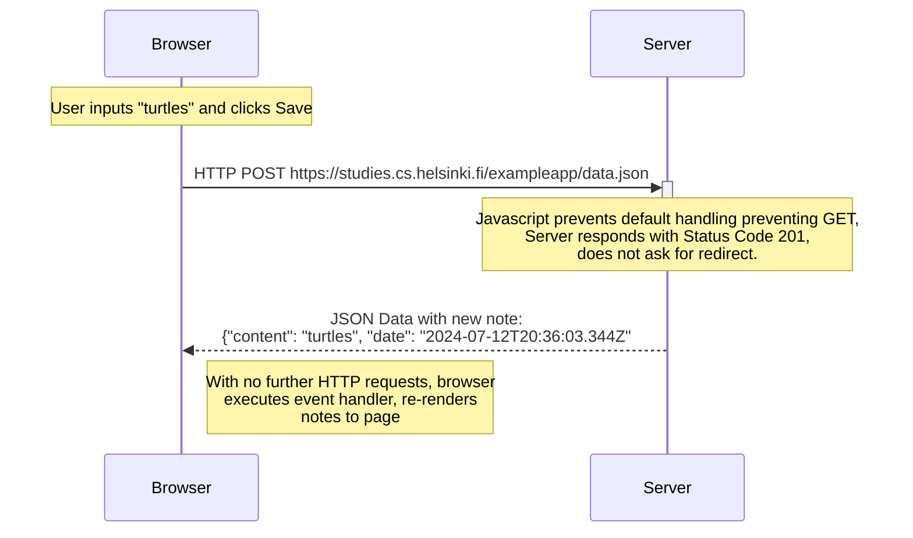

User creates a new note in Single Page App, operations shown as below.

```mermaid
sequenceDiagram
    Participant A as Browser
    Participant B as Server
    Note over A: User inputs "turtles" and clicks Save
    A->>+B: <br>HTTP POST https://studies.cs.helsinki.fi/exampleapp/data.json
    Deactivate B
    Note over B: Javascript prevents default handling preventing GET,<Br>Server responds with Status Code 201,<br>does not ask for redirect. 
    B-->>A: <br>JSON Data with new note:<br>{"content": "turtles", "date": "2024-07-12T20:36:03.344Z"
    Note right of A: With no further HTTP requests, browser<br>executes event handler, re-renders<br> notes to page
```    